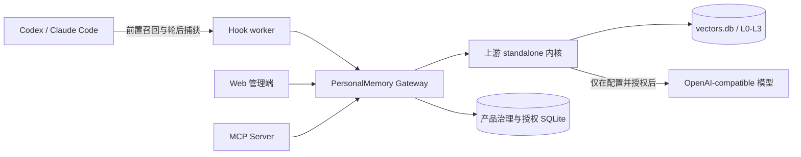

# PersonalMemory 技术方案

> 状态：当前产品技术事实源  
> 适用版本：`personalmemory-v0.1.1` 之后的当前开发分支

本文描述 PersonalMemory 的整体运行机制。用户安装与操作以根目录
[README](../README.md) 为准；不可变产品决策以
[PROJECT_RULES](PROJECT_RULES.md) 为准；精确接口契约继续由相关架构文档和代码测试定义。

## 1. 系统边界

PersonalMemory 是单用户、本地优先的 Chat Memory 产品。受管运行时由上游
TencentDB-Agent-Memory standalone 内核、PersonalMemory Gateway、Hook worker、MCP
Server 和 Web 管理端组成，全部默认只监听或访问本机回环地址。Web 不直接读取数据库，Agent
也不直接绕过 Gateway 访问记忆。



## 2. 从对话到可召回记忆

1. 主 Agent 成功完成一轮后，Hook 把本轮 user/assistant 原文提交给 Gateway。
2. Gateway 在同一个本地事务内完成敏感内容门禁、幂等落账和 L0 写入。
3. L0 提交成功后，Gateway 在事务外异步向上游管线发送仅通知事件；Hook 请求不等待模型。
4. 上游 `StatefulPipelineManager` 负责 warmup、累计轮数和空闲计时等触发语义，并调度 L1 提炼。
5. 提炼结果作为 `pending` L1 进入收件箱；模型配置、授权、调度或提炼失败时 L0 保留。
6. 用户批准 L1 后，它才进入自动召回候选。下一轮提示提交前，Hook 只注入通过治理门禁的 approved L1。

当前上游默认触发语义为：新会话 warmup、后续每累计 5 轮，以及约 10 分钟空闲刷新。它们是管线实现参数，不是“每轮立即产生 L1”的产品保证。

## 3. L0-L3

| 层级 | 含义                         | 当前生成与使用                                       |
| ---- | ---------------------------- | ---------------------------------------------------- |
| L0   | 原始 user/assistant 对话证据 | Hook 本地捕获；可浏览和追溯；默认不自动注入 Agent    |
| L1   | 单条事实、偏好或约束         | 模型异步提炼；先 pending，批准后才可自动召回         |
| L2   | 场景化长期记忆               | 由上游管线聚合；MVP 以查看和来源可用性披露为主       |
| L3   | Persona 与长期倾向           | 由上游管线进一步归纳；MVP 以查看和来源可用性披露为主 |

L0 是证据，不等于已经批准的长期记忆。相似检索结果也不等于来源关系；缺少真实引用时界面必须显示“来源未记录”。

## 4. 模型配置与外联授权

首版只支持 OpenAI-compatible 接口。Web 设置页保存 provider、Base URL、API Key 和模型名；API Key
只写入权限为 `0600` 的受管 `gateway.env`，读取接口永不回传密钥。macOS 使用 `~/Library/Application Support/PersonalMemory Runtime/gateway.env`，Linux 使用 `${XDG_STATE_HOME:-~/.local/state}/personalmemory/gateway.env`。密钥不进入浏览器、授权账本或记忆数据库。远端地址必须使用 HTTPS，只有回环地址允许 HTTP。

保存配置不等于允许联网。Web 会单独展示目标 origin 和可能发送的字段，用户确认后才写入版本化模型外联授权。provider、origin 或发送字段变化会使旧授权失效。配置或授权变化后需执行受管重启：

```sh
personalmemory restart
```

未配置、未授权或已撤销时，L0 捕获继续工作，但需要模型的 L1-L3 提炼暂停。模型请求可能包含模型输入、选中的记忆上下文和导入的对话消息；准确集合以 Web 当次披露为准。

撤销授权只在版本化账本追加撤销状态，不删除 `gateway.env` 中的密钥或配置，也不删除任何记忆；受管重启后停止新的外联。删除模型配置是单独操作，会从 `gateway.env` 移除模型字段和 API Key，但不删除记忆。

提炼 runner 直接调用模型接口，不产生 Agent 生命周期 Hook 事件。请求和响应均不得写入 L0；解析结果只进入 L1-L3 管线。兼容上游 session 的入口还必须拒绝内部 memory pipeline session，作为防递归的第二道门禁。

## 5. 一致性与失败语义

- L0 与 Hook 幂等记录同事务提交；提炼通知不得进入该事务。
- 只有新提交触发通知，重复 idempotency key 不重复调度。
- 通知和模型失败不得把成功的 L0 捕获改成失败。
- 自动召回约束条数、字符、估算 token 和超时，失败时 Agent 继续处理原提示。
- 新 L1 默认 pending；审核、失效、删除、冲突和替代治理发生在 PersonalMemory Gateway。

## 6. 安全与隐私

默认零模型外联；回环监听；浏览器以本地令牌换取短期 HttpOnly 会话，并使用 CSRF 保护写操作。Hook
捕获前执行来源排除与固定敏感类别阻断。模型密钥不写产品数据库、不写浏览器存储、不通过状态 API 返回。

更精确的安全边界见 [SECURITY_THREAT_MODEL](architecture/SECURITY_THREAT_MODEL.md)、[AUTOMATIC_AGENT_MEMORY_HOOKS](architecture/AUTOMATIC_AGENT_MEMORY_HOOKS.md) 与 [CONFIGURATION](architecture/CONFIGURATION.md)。

## 7. 数据与事实源

运行时记忆和索引由上游本地存储维护，PersonalMemory SQLite 保存审核、授权、治理、审计和 Hook
幂等状态。JSON/Markdown 是可读导出，不是可直接重建索引的权威导入格式；跨安装恢复使用经过校验的完整备份。

可移植数据与事实源见 [PORTABLE_DATA](architecture/PORTABLE_DATA.md)，删除契约见 [PRIVACY_ERASURE](architecture/PRIVACY_ERASURE.md)，运行边界见 [GATEWAY_BOUNDARY](architecture/GATEWAY_BOUNDARY.md)。

## 8. 当前能力边界

- 正式验证平台为 macOS arm64 和 Linux arm64；暂不使用 Docker。
- L2/L3 的完整下级来源链、复杂审核与结构化编辑尚未作为 MVP 承诺。
- 可读 JSON/Markdown 尚不能导入并重建索引。
- Web 保存配置和授权，但不会自行重启本机进程。
- 模型提炼是异步任务，看到 L0 后不保证立即看到 L1。

路线与非目标见 [MVP_GAPS_AND_ROADMAP](MVP_GAPS_AND_ROADMAP.md)。历史阶段实现证据位于 [implementation-records](implementation-records/README.md)。

## 9. 文档事实源

1. [README](../README.md)：用户功能、安装、配置和故障排查。
2. 本文：当前整体技术方案。
3. `docs/architecture/`：精确子系统契约和 ADR。
4. [PROJECT_RULES](PROJECT_RULES.md)：已确认且有约束力的产品决定。
5. `docs/implementation-records/`：历史实施证据，不覆盖当前文档。
6. [README_CN](../README_CN.md)：上游 TencentDB-Agent-Memory 参考资料，不是 PersonalMemory 使用说明。
