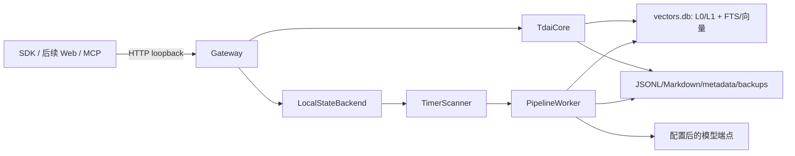

# 当前架构与数据边界

> 证据基线：`integration/upstream-v1.0.1` 的 `b839d92`。本文描述当前源码，不代表 PersonalMemory 最终产品承诺。

## 1. 进程与模块

**当前源码：** standalone 运行形态是单个 Node.js Gateway 进程。进程内包含 HTTP Server、`TdaiCore`、本地状态后端、Timer Scanner、Pipeline Worker、StorePool 和本地 StorageAdapter；不需要 Redis、COS 或 TencentDB。

**Phase 1 目标：** `service` 模式及 OpenClaw/Hermes 适配器保留为上游兼容面，但不作为个人版首发运行依赖。

| 模块                                   | 当前职责                                              | Phase 1 边界                                         |
| -------------------------------------- | ----------------------------------------------------- | ---------------------------------------------------- |
| `src/gateway`                          | 配置、HTTP、鉴权/CORS、v1/v2 路由、进程生命周期       | 由 PersonalMemory 外观层包装，不直接作为稳定产品 API |
| `src/core`                             | L0 捕获、L1 提炼、L2 场景、L3 Persona、检索和存储抽象 | 作为上游核心保留可辨识边界                           |
| `src/services`                         | 定时扫描和 L1-L3 异步任务执行                         | standalone 进程内运行                                |
| `src/adapters/standalone`              | OpenAI-compatible LLM 调用和本地主机适配              | Phase 1 目标：只在明确启用 provider 后外联           |
| `sdk/typescript`、`sdk/python`         | 当前 v2 HTTP 客户端                                   | 保持兼容；产品 UI/MCP 走 PersonalMemory API          |
| `src/offload*`                         | 上下文压缩和后端模式                                  | 非 MVP 主闭环，不删除但不扩展                        |
| `src/adapters/openclaw`、插件/安装脚本 | 上游宿主集成                                          | 非首发默认入口                                       |

## 2. 进程、端口与信任边界

- 腾讯上游 standalone Gateway 默认监听 `127.0.0.1:8420`；PersonalMemory Gateway 默认监听 `127.0.0.1:8787`，Web 只经后者访问产品 API；测试允许端口 `0`。
- `/health` 无鉴权；其他 v1 路由由可选 Bearer Token 保护。
- v2 路由还要求非空 `Authorization: Bearer ...` 和 `x-tdai-service-id`。未配置服务端 API Key 时，任意非空 Bearer 值仍能通过 v2 路由内层校验，因此“只监听 loopback”是当前首要防线。
- CORS 默认不返回跨域头。显式 `*` 会放开浏览器来源。
- **Phase 1 目标：** Web 与 MCP 是独立客户端/进程边界，经稳定的 PersonalMemory Gateway API 访问核心；不得直接操作 SQLite 或数据文件。
- **MVP 目标：** 非 loopback 监听不属于支持范围；未来如开放，必须同时启用强认证并经过独立威胁评审。

## 3. 当前数据流

当前 embedding provider 默认为 `none`，可观测性开关默认关闭；但 LLM 配置即使没有 Key 仍带有公网 `https://api.openai.com/v1` 和 `gpt-4o` 默认值。standalone adapter 会创建 runner，提炼任务达到触发条件后可执行 `generateText`，因此现有上游空配置仍可能尝试向默认公网地址发送正文并随后因空凭证失败。当前版本不能宣称默认零外联。

代码中还存在 TCVDB、COS、Redis、OTel、ClickHouse、Kafka、Langfuse 和可选代理端点。**M1.2 阻断目标：** 未显式启用 provider 时不创建任何外联客户端，并用网络隔离和代理变量测试证明默认零外联。

## 4. 存储清单与事实源现状

默认数据目录是 `~/.memory-tencentdb/memory-tdai/`，若新目录不存在但旧 `~/memory-tdai` 存在，会继续使用旧目录。当前主要资产：

| 资产                             | 内容                                 | 当前角色                                   |
| -------------------------------- | ------------------------------------ | ------------------------------------------ |
| `vectors.db`                     | L0/L1 元数据、FTS、向量表            | 当前查询和索引事实源                       |
| `conversations/YYYY-MM-DD.jsonl` | standalone L0 可读镜像               | 追加写；当前删除 API 不级联修改            |
| `records/YYYY-MM-DD.jsonl`       | L1 追加记录及来源 ID                 | 可读恢复资产；更新/合并不会物理改写旧行    |
| `scene_blocks/*.md`              | L2 场景文件                          | L2 当前内容源                              |
| `persona.md`                     | L3 Persona                           | L3 当前内容源                              |
| `.metadata/*`                    | 索引、checkpoint、manifest、实例信息 | 派生状态和恢复辅助数据                     |
| `.backup/*`                      | Persona/场景备份                     | 当前局部备份，不是完整产品备份             |
| 日志                             | console 与可选文件/遥测              | 可能包含操作元数据；内容策略需在 M1.2 收紧 |

当前实现存在事实源分裂：`l1-writer.ts` 把 JSONL 注释为备份/恢复事实源，但在线查询、修改和删除只操作 SQLite，旧 JSONL 行不会同步改写。事实源目标由 ADR-0003 冻结：SQLite 是运行时权威状态，可读资产必须可导出。M4.7 明确可读导入与索引重建是长期方向而非 MVP 能力；当前迁移和恢复只使用已验证完整备份。

## 5. L0-L3 API 与当前删除语义

| 层  | v2 API                                 | 当前写/读语义                                   | 当前删除语义与缺口                                                      |
| --- | -------------------------------------- | ----------------------------------------------- | ----------------------------------------------------------------------- |
| L0  | `conversation/add/query/search/delete` | 写 SQLite，并在 standalone 追加 JSONL           | 删除 SQLite 元数据、FTS、向量；不会删除 JSONL、L1-L3 派生物、备份或日志 |
| L1  | `atomic/update/query/search/delete`    | 更新 SQLite；自动提炼另会追加 records JSONL     | 删除 SQLite 元数据、FTS、向量；不会改写 records JSONL 或级联 L2/L3      |
| L2  | `scenario/ls/read/write/rm`            | Markdown 文件；写入/删除时尽力同步 profile 索引 | 删除单文件/目录并尽力删 profile；备份、引用和派生 L3 不保证级联         |
| L3  | `core/read/write`                      | 读取/覆盖 `persona.md` 并尽力同步 profile       | 没有独立 L3 删除 API                                                    |

`POST /v2/instance/destroy` 面向 service 模式实例，清理状态、StorePool 缓存和 COS 前缀；standalone 下不等价于清空本地数据目录，且会返回各子步骤的部分成功结果。PersonalMemory 不得把它暴露为“彻底删除全部记忆”。

## 6. 已确认未知项

- JSONL/Markdown 到 SQLite 的规范化导入、冲突处理和索引重建尚未实现，并已由 M4.7 明确后置到 MVP 之后。
- L0/L1 更新或删除后的追加日志表达、墓碑格式和压缩策略待 ADR（M2.5）。
- 完整备份是否包含日志、模型缓存和未来 UI 状态待 M2.6 定义；隐私级联删除不得等到备份格式确定后才设计（M3.4）。
- Linux/amd64、干净容器和文件权限仍未实测，不能写成已支持事实（M1、M5 验证）。
